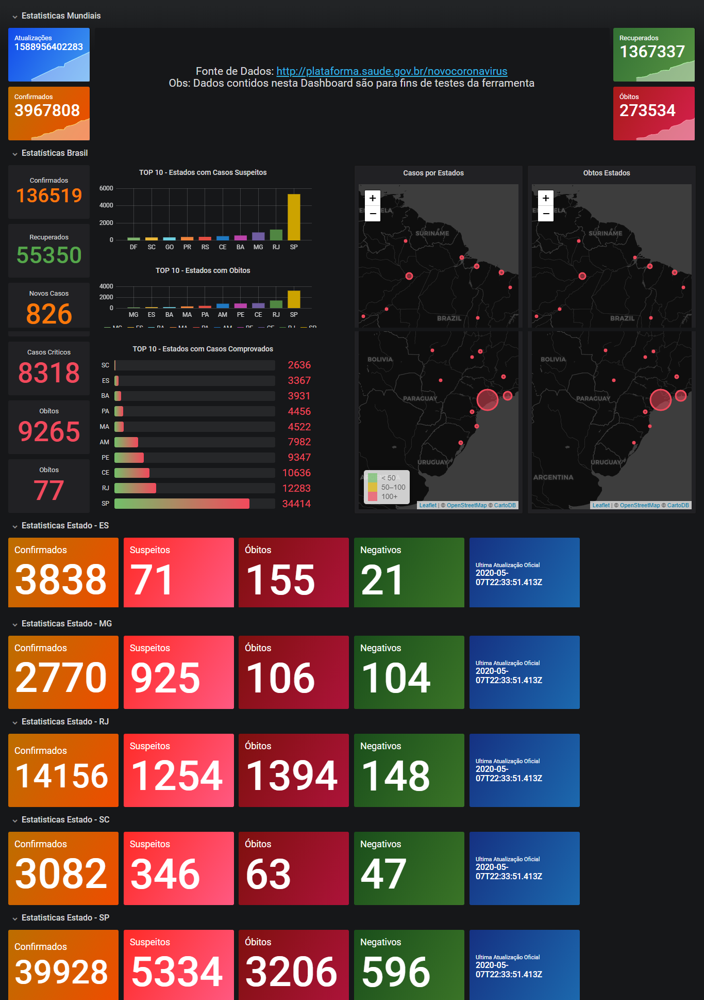

# ZBX-GRA-COVID19-BRAZIL
Template_Module_HTTP_LLD_Brazil_Corona

PT-BR

Homologado: 

Zabbix 4.4.6

Grafana 6.6.2

Plugins necessarios: 

1) grafana-worldmap-panel  - https://grafana.com/grafana/plugins/grafana-worldmap-panel
2) alexanderzobnin-zabbix-app - https://grafana.com/grafana/plugins/alexanderzobnin-zabbix-app

Importe o Template_Module_HTTP_LLD_W_Corona para o Zabbix 

Crie um host com nome "BRASIL-CORONA-COVID19", pode usar interface local (127.0.0.1: 10050) e o Hostgroup use o nome "CORONAVIRUS" e vincule o template ao host. 

Aguarde coleta de dados, ou utilize a função "Check now" no item e no LLD para agilizar a coleta

Importe a Dashboard no Grafana

Ao importar o Template para o Garfana, selecione seu Data Source.

Obs: Caso em paises não apareça a lista, verifique se as aplicações e itens foram gerados no Zabbix.

